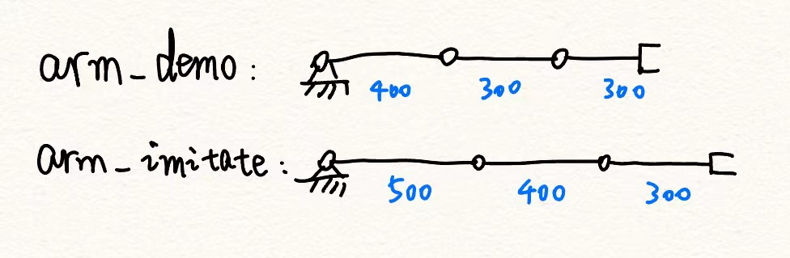
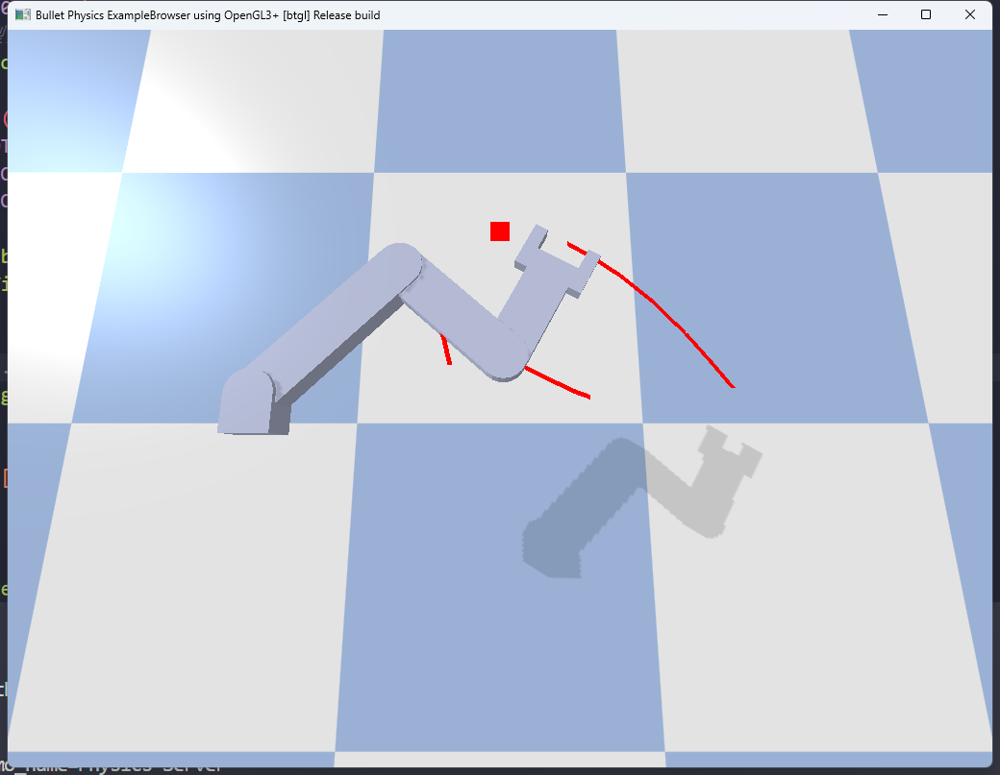
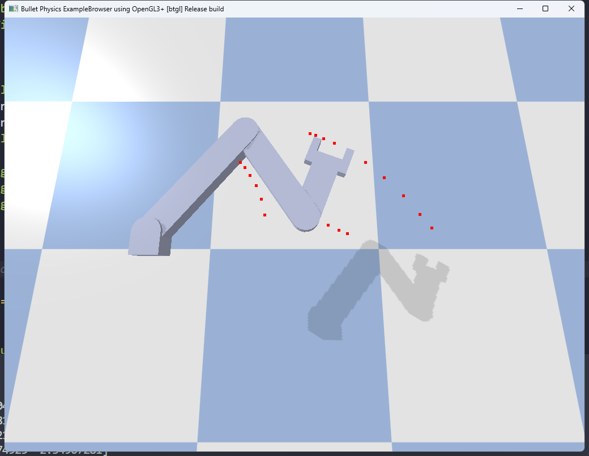

# Keypoint-based morphological imitation on 3-joint arm
Note: In order to correctly use PyBullet function p.getLinkState() to compulte keypoints location, adjust the cemter of mass on a link to coincide with its sub-joint.

